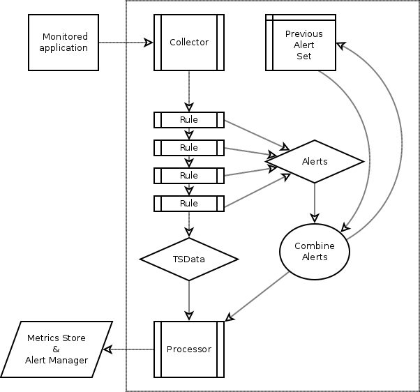

Datamodel
====

Data is collected by collectors from the application.
Collected data is described as Groups with Metrics.

After all data is collected, the raw collected data is transformed into a TSData set.
Group collisions are resolved, where the last collected group wins.
With the TSData set thus created, rules are evaluated to transform it.
Any alerts generated by the rules are kept separately, to be combined with previous alerts.

The final TSData and combined alerts are sent to a processor, which is responsible for any further actions.
The processor will typically talk with external systems to keep a historical record of metrics (such as making them available in Grapher).
The processor should also cause alerts to fire (for example, updating Nagios with the alerts so it can alert).

Groups and Metrics
----

The datamodel that the program uses, is one of groups of metrics.
A simple analogy is that of an object-oriented model, where groups are variables (of some arbitrary type) and metrics are member variables.

    group.name {
        metric_name = value,
        another_metric_name = another_value,
        ...
    }

A group has a name, which is one or more identifiers, separated by dots.

Inside the group, multiple metrics may be found, each having a name and a value.

The metric value can be either
- *boolean*: true or false
- *integral number*: 64 bit signed
- *floating point number*: 64 bit IEEE double
- *string*: UTF-8 sequence of characters, may include nul characters.

In addition, a metric value may be the empty metric value, indicating the absence of data.

The collectors produce raw groups with their metrics.

Time Series
----

Internally, the application converts groups to timeseries.
Timeseries are Groups with a timestamp attached.

    group.name {
        metric_name = value,
        another_metric_name = another_value,
        ...
    } at Dec 25, 2015 17:19:23.030

A complete set of Time Series from a collection, is called a Time Series Data (TSData) for short.
The rules operate on Time Series in the TSData.

Alerts
----

The application keeps a running set of alerts.
Each evaluation of the rules will result in a set of alerts, each of which may be *ok*, *unknown* or *triggering*.
Note that the *triggering* state in this point simply indicates if the alert predicate is *true*.

After a collection, the new set of alerts is compared with the previous set, to update the duration of the alerts.
If the newly emitted alert has the same state as the previous alert, the alert duration is extended.
The duration for which it has been triggered, will decide if the alert is simply **TRIGGERED** or **FIRING**.

Tags
----

Monsoon uses tags to decorate groups.
Tags define meta-data about the group, for instance the host from which the metric was collected.

Tags are displayed between curly braces as name-value pairs.

    { host="localhost", port=9999, 'foo-bar'=true }

Tags are present on both metrics and alerts.

When an operation is performed on tagged data, the operation matches up its left-hand side and right-hand side, based upon tag equality.
Suppose:

    group.'1'{host="localhost"}  {
        value = 1
    }
    group.'1'{host="otherhost"}  {
        value = 2
    }
    group.'2'{host="localhost"}  {
        value = 3
    }
    group.'2'{host="otherhost"}  {
        value = 4
    }

when applied to the expression:

    group.'1' value * group.'2' value

will yield tagged values:

    {host="localhost"} =  2
    # group.'1'{host="localhost"} value * group.'2'{host="localhost"} value

    {host="otherhost"} = 12
    # group.'2'{host="otherhost"} value * group.'2'{host="otherhost"} value

Without specification, tags must match up identical on both sides of the expression to allow it to evaluate.
This can be overriden using a ``by``-clause.
Tags are propagated, so the result of an expression is tagged.

Scalars (i.e. values) are special, in that they are untagged.
This special property allows them to match up with any other scalar (producing a new scalar) or with any tagged value (maintaining the tags from the tagged value).

Processing
----

After the rule engine has run, the processor picks up the results.
Typically, a processor will add all metrics to a metric engine and give any alerts to an alert manager.
